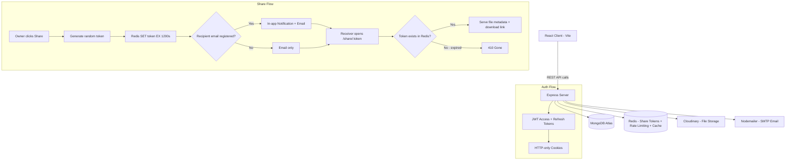
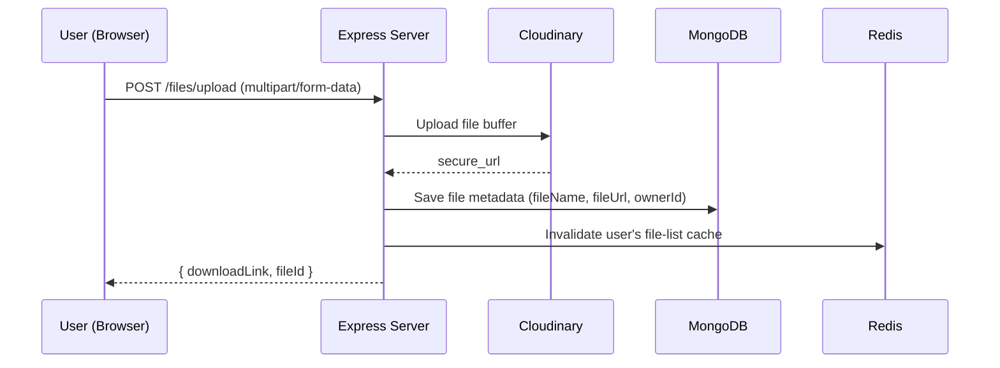

<div align="center">

# CloudIt - A Cloud Based File Sharing Application


 
</div>


## About

**CloudIt** is a secure file sharing platform that allows users to upload, search, and share files with ease - including **time-bound share links that self-expire after 20 minutes**, using Redis TTL. Recipients can be notified via **email**  and  **in-app notifications** (if a registered user), so sharing always reaches the right place.

---

## System Architecture



### Request Flow — File Upload




## Features

- **User Authentication** - JWT-based auth with HTTP-only cookies (access + refresh token flow)
- **File Upload** - Secure upload to Cloudinary 
- **Expiring Share Links** - Redis TTL-backed tokens,auto-expire in exactly 20 minutes.
- **Dual-Channel Sharing** - Recipient gets an email always, plus an in-app notification if they're a registered CloudIt user
- **In-App Notifications** - Bell icon with live unread count, polling every 30s
- **File Search** -  Debounced search-by-filename, scoped to the logged-in owner
- **Access Control** - Per-file access list in addition to owner-only actions (share, delete)
- **Caching** - Cache-aside pattern for file metadata and user file lists (Redis)
- **Responsive Design** - Tailwind CSS, works across screen sizes

---

## Tech Stack

**Frontend:**
- React.js (Vite)
- Tailwind CSS
- React Router

**Backend:**
- Node.js + Express.js
- MongoDB with Mongoose (Atlas-hosted)
- Redis (ioredis) — share tokens, rate limiting, caching

**Authentication:**
- JWT (JSON Web Tokens) — access + refresh token pattern
- bcrypt — password hashing
- HTTP-only cookies

**File Storage:**
- Cloudinary

**Notifications:**
- Nodemailer (SMTP/Gmail)-email delivery
- MongoDB-backed in-app notifications

---

## Getting Started

### Prerequisites

- Node.js (v18+)
- MongoDB Atlas account (or local MongoDB)
- Redis instance (local, Docker, or hosted — e.g. Upstash)
- Cloudinary account
- Gmail App Password (or any SMTP credentials) for email

### Installation

1. **Clone the repository**
   ```bash
   git clone https://github.com/priyanshu026922/CloudIt.git
   cd CloudIt
   ```

2. **Install backend dependencies**
   ```bash
   cd server
   npm install
   ```

3. **Install frontend dependencies**
   ```bash
   cd ../client
   npm install
   ```

4. **Set up environment variables**

   Create a `.env` file in the `server` directory:
   ```env
   PORT=8000
   MONGODB_URI=your_mongodb_atlas_connection_string
   CORS_ORIGIN=http://localhost:3000

   ACCESS_TOKEN_SECRET=your_access_token_secret
   ACCESS_TOKEN_EXPIRY=1d
   REFRESH_TOKEN_SECRET=your_refresh_token_secret
   REFRESH_TOKEN_EXPIRY=7d

   CLOUDINARY_CLOUD_NAME=your_cloud_name
   CLOUDINARY_API_KEY=your_api_key
   CLOUDINARY_API_SECRET=your_api_secret

   REDIS_HOST=127.0.0.1
   REDIS_PORT=6379
   REDIS_PASSWORD=your_redis_password

   EMAIL_USER=youraddress@gmail.com
   EMAIL_PASS=your_gmail_app_password

   CLIENT_URL=http://localhost:3000
   ```

5. **Run the application**

   Start the backend server:
   ```bash
   cd server
   npm start
   ```

   Start the frontend (in a new terminal):
   ```bash
   cd client
   npm run dev
   ```

6. **Access the application**
   - Frontend: `http://localhost:5173`
   - Backend API: `http://localhost:8000`

---

## API Overview

| Method | Endpoint | Auth | Description |
|---|---|---|---|
| `POST` | `/api/v1/files/upload` | Required | Upload a file to Cloudinary |
| `GET` | `/api/v1/files/download/:fileId` | Required | Get an authenticated download link |
| `GET` | `/api/v1/files/search?q=` | Required | Search owner's files by name |
| `POST` | `/api/v1/files/:fileId/share` | Required | Generate a 20-min share link |
| `POST` | `/api/v1/files/:fileId/share-to-email` | Required | Share a file via email + in-app notification |
| `GET` | `/api/v1/files/share/:token` | Public | Fetch shared file metadata (expires with Redis TTL) |
| `GET` | `/api/v1/notifications` | Required | Fetch recent notifications |
| `PATCH` | `/api/v1/notifications/:id/read` | Required | Mark a notification as read |

---

<div align="center">

Built with ❤️ by [Priyanshu](https://github.com/priyanshu026922)

</div>