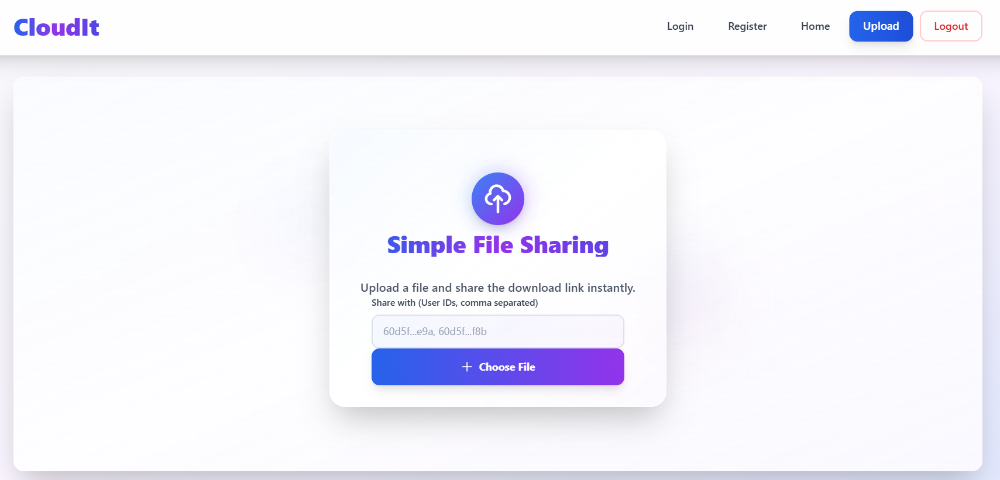

# CloudIt - A Brief Description 🚀

<div align="center">

</div>

---

## 📱 Screenshots

<div align="center">

### 🏠 Home Page


### 📊 SignUp


### 📁 Login


### 🏠 Upload & DownLoad file


### Share File


</div>

## 🎯 About

**CloudIt** is a secure file sharing platform that allows users to upload, share, and manage files with ease. Built with modern web technologies, it provides a clean interface and robust functionality for file management.

## ✨ Features

- 🔐 **User Authentication** - Secure registration and login with JWT
- 📁 **File Upload** - Upload files securely  
- 🔗 **File Sharing** - Generate shareable links for easy access
- 👥 **Access Control** - Manage who can view and download files
- ☁️ **Cloud Storage** - Files stored securely on Cloudinary
- 📱 **Responsive Design** - Works seamlessly on all devices
- ⚡ **Fast Performance** - Optimized for speed and efficiency

## 🛠 Tech Stack

**Frontend:**
- React.js
- Tailwind CSS  
- React Router

**Backend:**
- Node.js
- Express.js
- MongoDB with Mongoose

**Authentication:**
- JWT (JSON Web Tokens)
- bcrypt

**File Storage:**
- Cloudinary

## 🚀 Getting Started
### Installation

1. **Clone the repository**
   ```bash
   git clone https://github.com/username/repository-name.git
   cd repository-name
   ```

2. **Install backend dependencies**
   ```bash
   cd server
   npm install
   ```

3. **Install frontend dependencies**
   ```bash
   cd ../client
   npm install
   ```

4. **Set up environment variables**
   
   Create `.env` file in the server directory:
   ```env
   PORT=5000
   MONGODB_URI=your_mongodb_connection_string
   JWT_SECRET=your_jwt_secret_key
   CLOUDINARY_CLOUD_NAME=your_cloud_name
   CLOUDINARY_API_KEY=your_api_key
   CLOUDINARY_API_SECRET=your_api_secret
   CORS_ORIGIN=http://localhost:3000
   REFRESH_TOKEN_SECRET=
   REFRESH_TOKEN_EXPIRY=
   ```

5. **Run the application**
   
   Start backend server:
   ```bash
   cd server
   npm start
   ```
   
   Start frontend (in new terminal):
   ```bash
   cd client
   npm start
   ```

6. **Access the application**
   - Frontend: `http://localhost:3000`
   - Backend API: `http://localhost:5000`

---

<div align="center"
</div>
